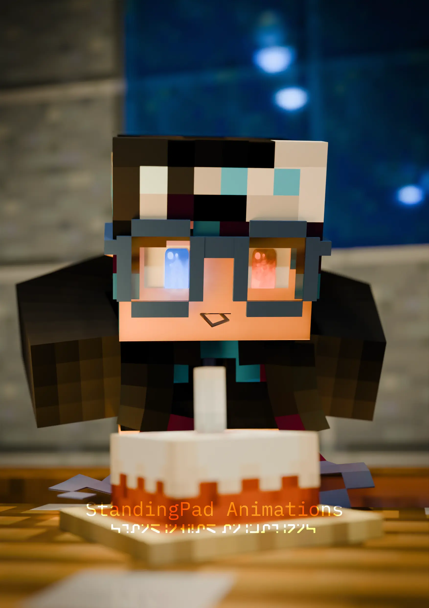
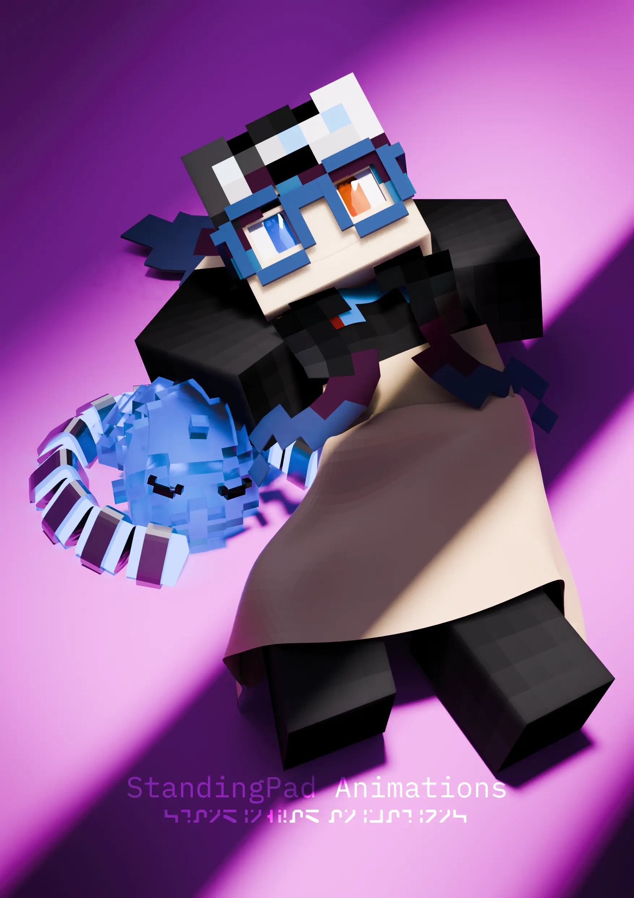
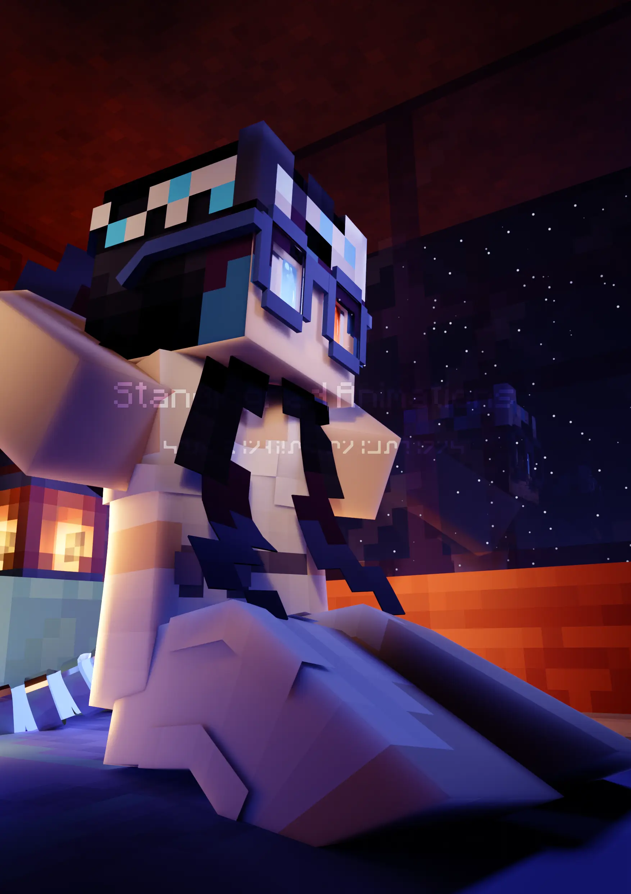

<link rel="stylesheet" href="overrides.css">



- Pakistani-American 3D Artist with 3+ years of Blender experience 



# Previous Work


## Work I've done in My Spare Time
*Click an image to expand*

  
  
  
  
  
  
  
  
  
  
  
  
  
  
  
  


# Development Experience
- Primary Languages:
    - Python
    - C++
    - Rust
- with experience using:
    - Haskell
    - Go
    - Lua
    - Bash

## Past and Present Work
- Maintainer for the MCprep addon, a Blender addon that speeds up the workflow of Minecraft animators by providings tools such as material generation, importing premade rigs, creating automatic weather effects, and more, all with the click of a button.
    - 

- Project Lead for Resurgence Virtual Machine development, a project that aims to create an easy to implement specification and reference implementation for a virtual machine architecture based on real world computers.
    - 

- Creator of `bpy-addon-build` (also known as `bpy-build`), a program that aims to streamline the process of building Blender addons and automatically installing them to the targeted Blender versions, allowing developers to perform less mundane tasks and more development.
    - 

- Experience creating toy languages.
    - 
    - 

# Contact
Interested? Contact me at [contact@standingpad.org](mailto:contact@standingpad.org)

*Unsoliciated advertisements will result in me blocking your email address and adding it to a public list of all email addresses blocked here, so please ___do not send me advertisements though email___*
