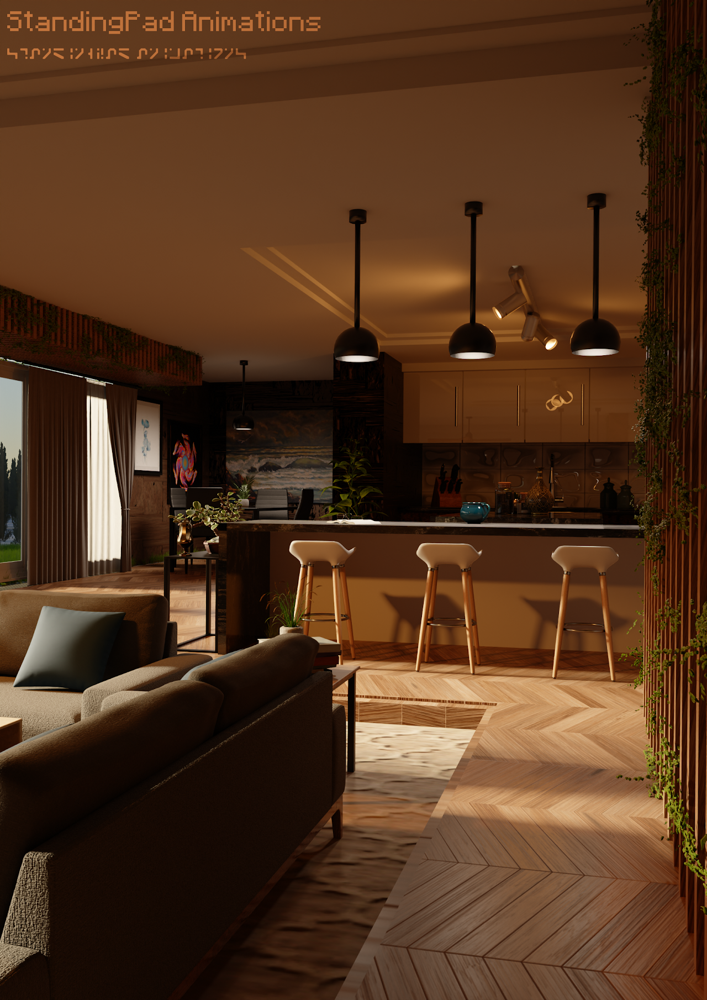
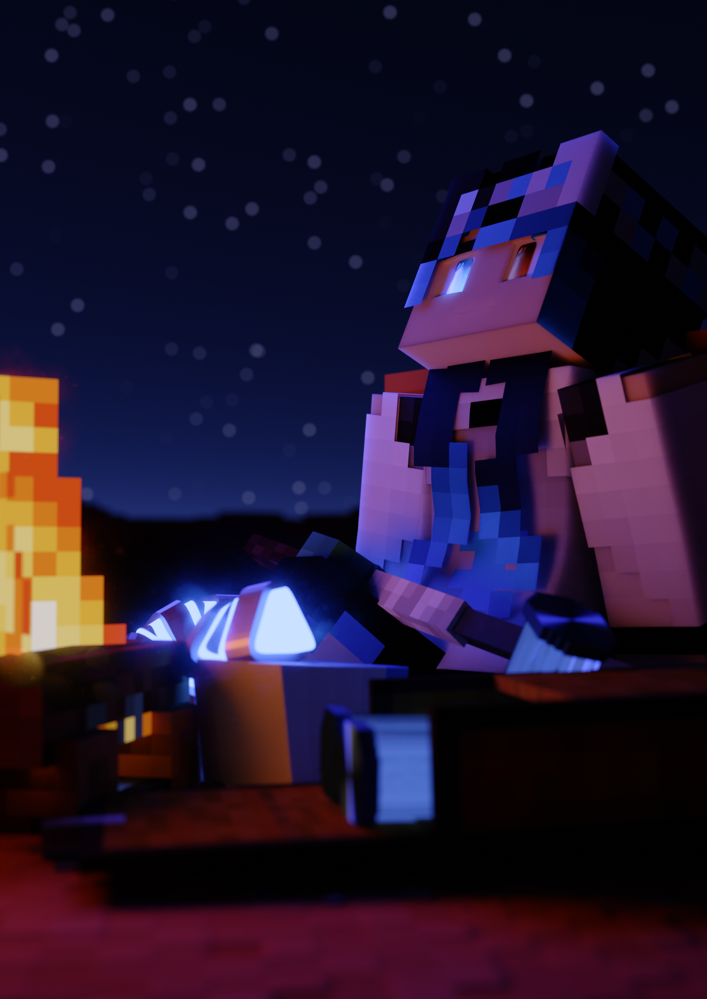
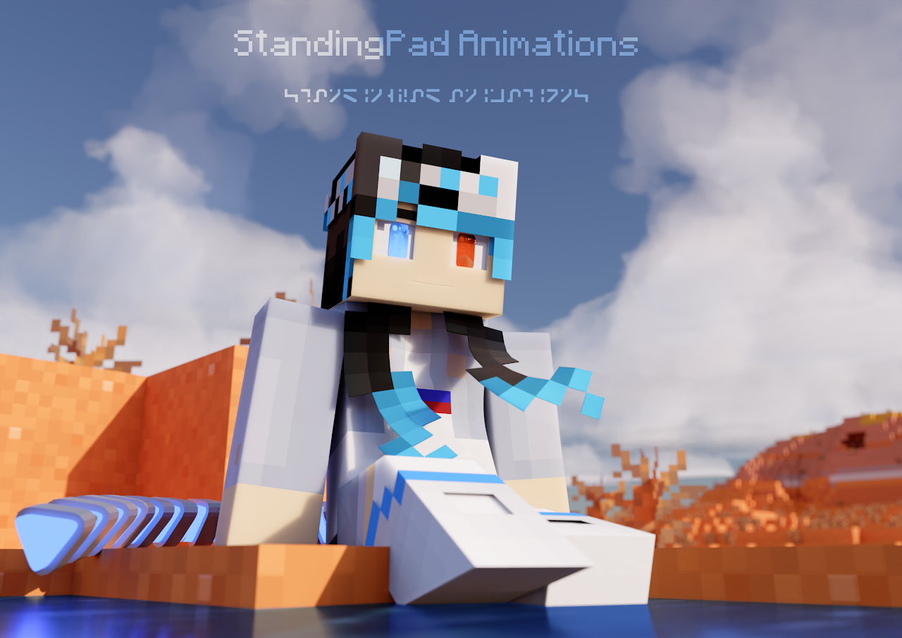
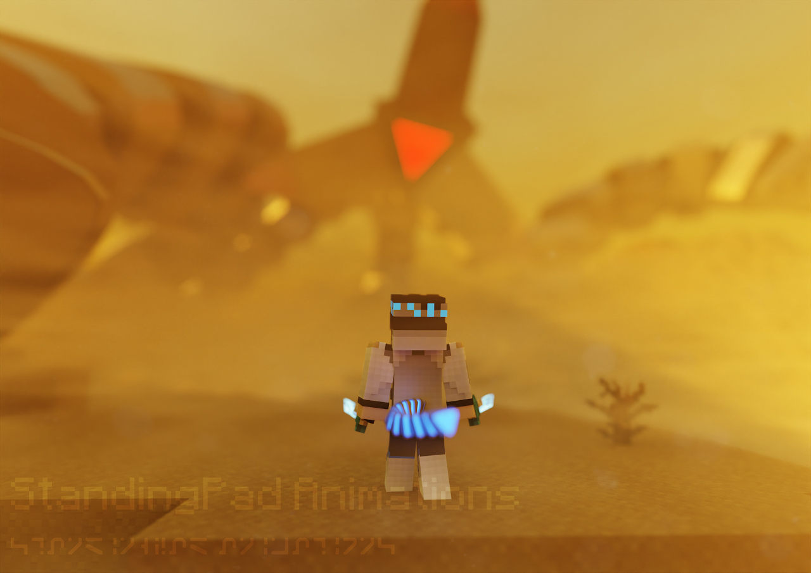

# About Me

* 3D Artist with Blender experience
* Certified Revit User
* MCprep Developer
* Creator of the Rendor Programming Language and Resurgence Virtual Machine 
* Pakistani-American; Ahmadi Muslim

### Certifications


# Here's some of my work


  
  
  
  
  
  


