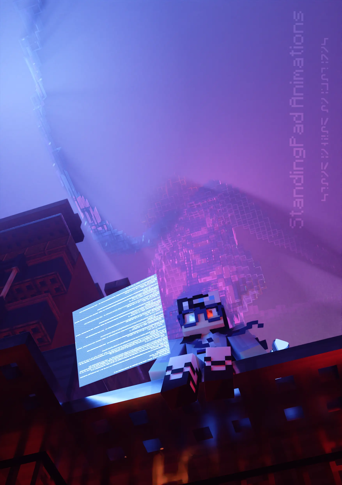

<link rel="stylesheet" href="overrides.css">



- 3D Artist with 3+ years of Blender experience



# Some More Stuff on Me

  
  
  
  
  
  


- Pakistani-American in Dallas, Texas
- Ahmadi Muslim [^1]
- Yes I have a beard. No, I do not want to do a clean shave

[^1]: There is conflict in the Islamic world over the religious identity of us Ahmadi Muslims, see [here](/heretic) for more

# Previous Work
## Professional Work
MCprep 3.5 Splash Screen


## Work I've done in My Spare Time
*Click an image to expand*

  
  
  
  
  
  
  
  
  
  
  
  


## Major Pieces
Since December 2023, I've been doing 2 major pieces a year, one on summer and one in winter, noted with a black border. These are pieces where I try and break my limits, and demonstrate what I've learned in the past several years.

### 2023
2023 only had one major piece, the winter piece for New Years


# Development Experience
- Primary Languages:
    - Python
    - C++
    - Rust
- with experience using:
    - Haskell
    - Go
    - Lua
    - Bash

## Past and Present Work
- Maintainer for the MCprep addon, a Blender addon that speeds up the workflow of Minecraft animators by providings tools such as material generation, importing premade rigs, creating automatic weather effects, and more, all with the click of a button.
    - 

- Formar Project Lead for Resurgence Virtual Machine, a project that aimed to create an easy to implement specification and reference implementation for a virtual machine architecture based on real world computers.
    - 

- Creator of `bpy-addon-build` (also known as `bpy-build`), a program that aims to streamline the process of building Blender addons and automatically installing them to the targeted Blender versions, allowing developers to perform less mundane tasks and more development.
    - 

- Experience creating toy languages.
    - 
    - 

# Contact
Interested? Contact me at [contact@standingpad.org](mailto:contact@standingpad.org)

*Unsoliciated advertisements will result in me blocking your email address and adding it to a public list of all email addresses blocked here, so please ___do not send me advertisements though email___*
