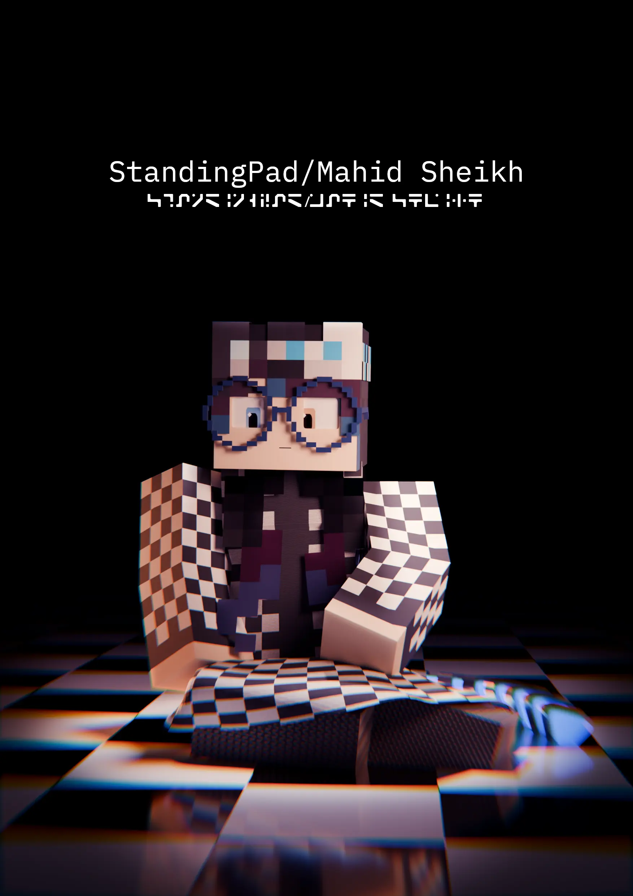

<link rel="stylesheet" href="overrides.css">



<br class="linebreak-cls">

Hey there, I'm Mahid Sheikh, a 3D artist and developer from the Dallas-Fort Worth metroplex in Texas. I'm also a Pakistani-American (born in the US) and an Ahmadi Muslim [^1]. My main area is Minecraft rendering, and I work on the MCprep addon for Blender. In addition, I also maintain the Flatpak package for Bforartists. Outside of 3D rendering and programming, I play the flute (played for my local high school marching band), do some photography, or read.

A bit boring, I'm aware.

[^1]: There is conflict in the Islamic world over the religious identity of us Ahmadi Muslims, see [here](/heretic) for my view on the matter

<div style="clear:both;"></div>

Here's some more pictures of me:

  
  
  
  
  
  


# 3D art work
My main area of work is Minecraft rendering. My main piece of software is Blender, though I also gained Revit certification in May of 2023.



## Professional Work
Here's some of the work I've done professionally.

### Release artwork for MCprep 3.5
MCprep is a workflow addon for Minecraft artists working in Blender, and I work as one of the maintainers of the project. Normally, we'd hold a contest with the community, but due to short notice, I was asked to make the release artwork for MCprep 3.5.


## Work I've done in My Spare Time
This is a curated selection of work I've done in my spare time. As mentioned earlier, my main focus is Minecraft rendering, but I've also dabbled a little in ArchViz rendering in the past.

*Click an image to expand*

  
  
  
  
  
  
  
  
  
  
  
  


## Major Pieces
Since December 2023, I've been doing 2 major pieces a year, one on summer and one in winter, noted with a black border. These are pieces where I try and break my limits, and demonstrate what I've learned in the past several years.

As a bit of a nerdy easter egg, the black border has a slight noise to the value of the original hex value (`#171717`), using the GnuIMP HSV noise filter, with the noise driven by the following script:
```py
from PIL import Image
import sys
import math
import random

def get_rgb_values(image_path):
    try:
        image = Image.open(image_path)
        rgb_values = list(image.getdata())
        return rgb_values
    except Exception as e:
        print(f"Error: {e}")
        return None

def main():
    if len(sys.argv) != 2:
        print("Usage: python rgb_values_extractor.py <image_path>")
        sys.exit(1)
    image_path = sys.argv[1]
    rgb_values = get_rgb_values(image_path)
    if rgb_values:
        x, y, z = (0, 0, 0)
        for r, g, b in rgb_values:
            x += r % 255
            y += g % 255
            z += b % 255
        
        random.seed(x*y*z)
        h, s = (random.uniform(0, 1), random.randint(0, int(math.sqrt(x+y+z))))
        print("Hue:", h, "Seed", s)

if __name__ == "__main__":
    main()
```

Meaning the border is unique per image. Cool, I know c:

### 2023
2023 only had one major piece, the winter piece for New Years


# Development Experience
I'm not only a 3D artist but also a programmer. My main languages are:
- Python
- C++
- Rust

Additionally, I have experience with:
- Haskell
- Go
- Lua
- Bash

## Development Work
My main development work encompasses multiple areas, but these days it's in addons that improve users workflows and contributing to open source projects in eneral. I'm one of the maintainers for the MCprep addon, a Blender addon that speeds up the workflow of Minecraft animators by providings tools such as material generation, importing premade rigs, creating automatic weather effects, and more, all with the click of a button.


In my MCprep career, I also created BpyBuild for the MCprep project. BpyBuild a program that aims to streamline the process of building Blender addons and automatically installing them to the targeted Blender versions, allowing developers to perform less mundane tasks and more development.


I'm also the maintainer of the Bforartists Flatpak package. Bforartists is a fork of Blender focused on improving the GUI experience for users, and I maintain the Flatpak build for Linux users who either prefer Flatpak or can only use a Flatpak version.


# Contact
Interested? Contact me at [contact@standingpad.org](mailto:contact@standingpad.org)

*Unsoliciated advertisements will result in me blocking your email address and adding it to a public list of all email addresses blocked here, so please ___do not send me advertisements though email.___*
