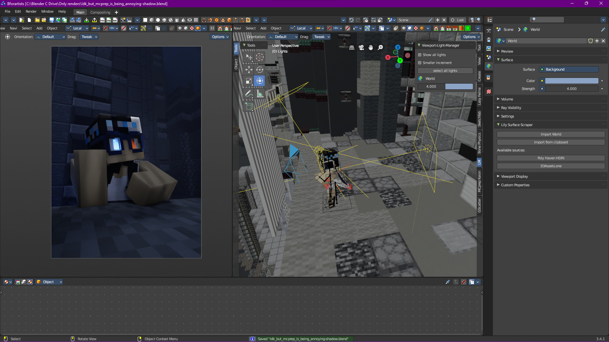
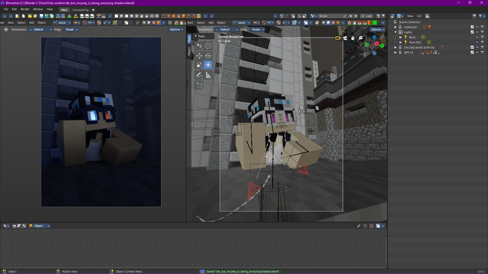
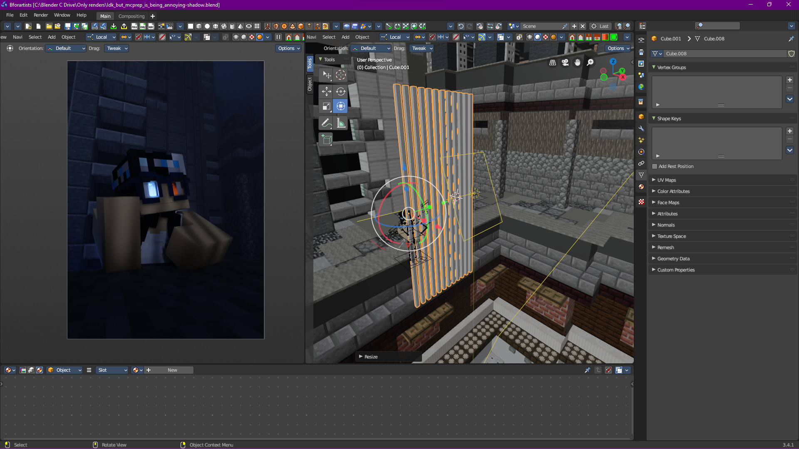
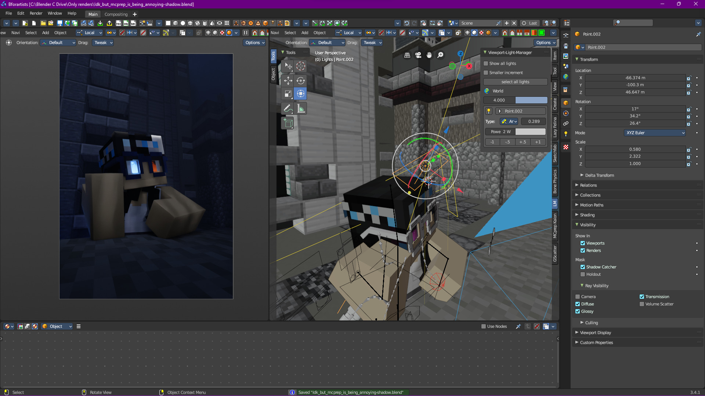

Remember how I said while writing, I realized another route that could have been taken with this scene that involved heavy use of shadow? Well, I think I'll quickly go over it (it's not that long).

We're aiming for something like this:


> While this route takes less steps, it's easier to mess up with, not to mention that the results tend to be a lot darker with this method.


First, let's start with the basic sea lantern lighting we did in [[#A Practical Example]]:

Now let's add an array of skinny cubes and behind them, an area light:


> This is a great oppertunity to take advantage of Beam Spread for softer shadows!


Next, lets add some basic rim lights:

And finally, let's add a very basic kick light behind the subject to add some extra shaping and to make the scene a little brighter:

I think we're done!


> Since this section is on alternative routes, I highly suggest looking for even more ways to use light to tell the story you want to tell. I've gone over 2 here, but I bet that you can think of a 3rd or even a 4th way of lighting this scene! That's one of the neat things about lighting, there's multiple ways to go about telling your story.


