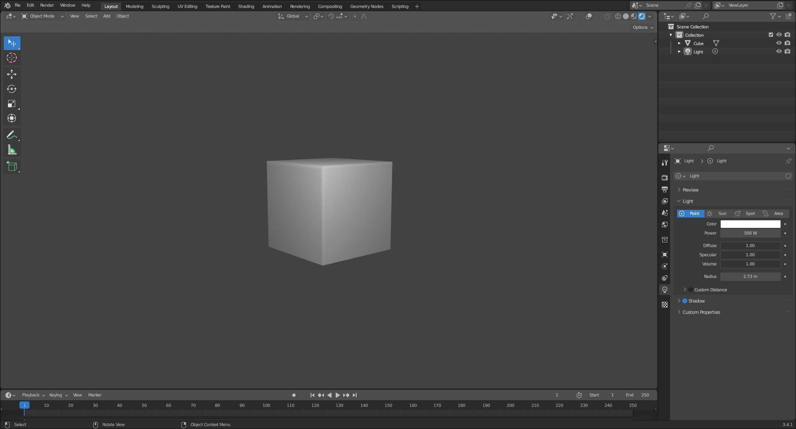
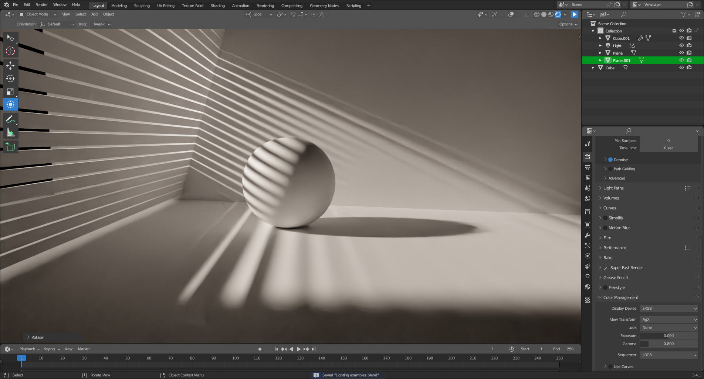
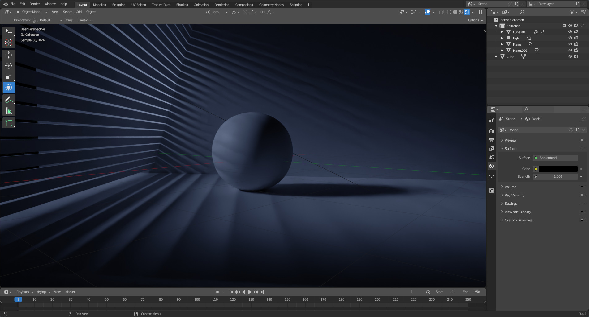
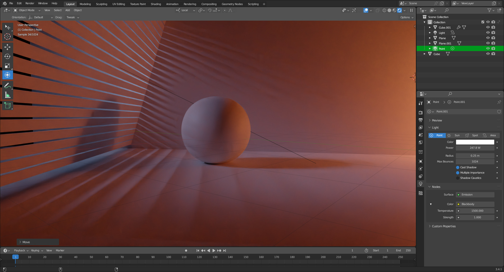

# Introduction
Hi there! If you're reading this, you might be asking yourself, “what can a Minecraft artist teach about lighting?”. Before you close your browser, though, I want you to think of this not as a guide, but a collection of tips from my years of doing Blender. Ok, let's continue.

Lighting may seem like something simple, but it gets complicated real fast. Simply moving a light a couple of centimeters (scene wise) can completely change how the resulting render feels to the viewer. Most people, however, seem to treat lighting as just something to get through, something to just edit in compositing.

I personally believe that one's lighting should be 90% of the way to the final render, hence this “guide” on how to improve one's lighting. In this "guide", I'm going to go over how I handle stuff like environment lighting, character lighting, and maybe a little stylization along the way.

Sure, I may be a relatively small artist in the 3D landscape, but who said small artists don't have experience. Without further ado, let's get started.

# Why Light?

This is a question most of us forget to ask: why should we light our scenes in the first place?

There are multiple answers. The first one is depth. Without light, there's no shadow, and without shadow, there is no depth.

For example, which one looks 3D?

You might say the second image, but why? Because the second image has some form of depth from a gradient. A pretty big difference, and we haven't even gotten into positioning lights yet.

There is a second reason, one that's emphasized, but not explained: storytelling. Let me explain.

# A Sphere's Story
Take this simple scene, what information does the lighting convey?

The lighting makes it clear that it's day time. Here's the same scene, but with a change in the light color and strength:

Now we can assume it's night. And what about this?

Well, the sphere's house is on fire and maybe the sphere is contemplating their life choices. And all we did was add another light source.

So clearly, lighting can make a big difference when it comes to story telling, and we've barely scratched the surface.
