We've gone over how to go about lighting, but what about deconstructing an existing lighting setup? It's actually simpler than you think.

# Simple Example
Let's start with the following scene:
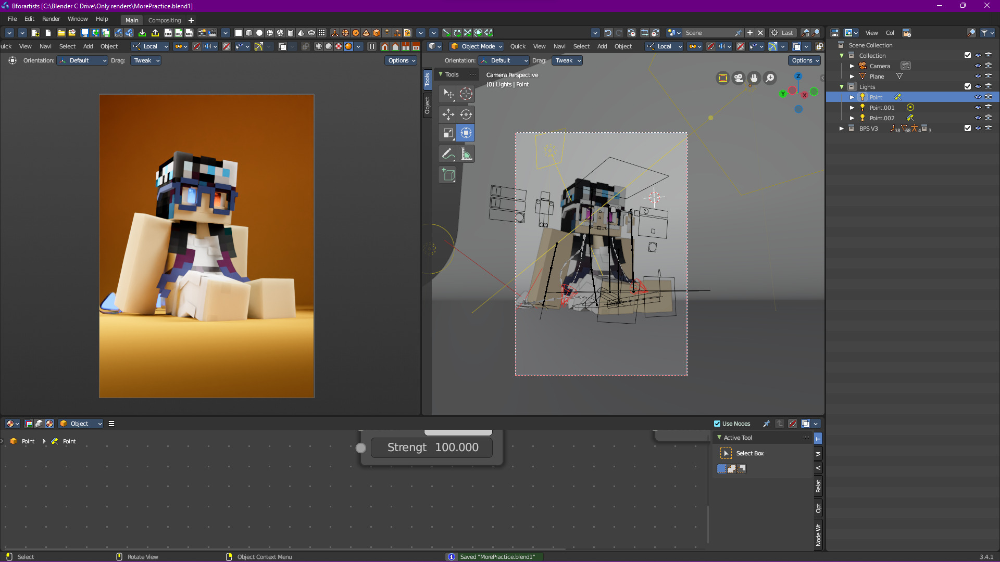

Here I've already constructed a lighting setup with 3 lights (yes, 3 lights). Firstly, we got our main light:
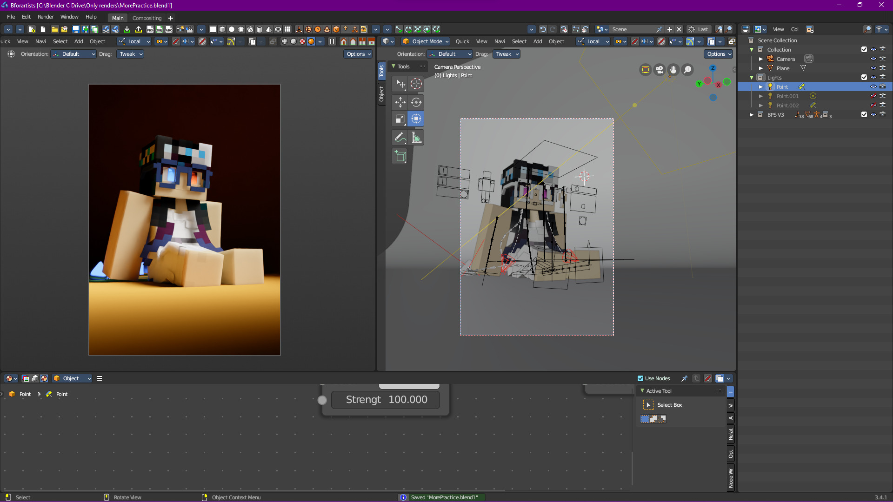

It's not that bad, but we’re losing a lot of details in the shadows. Sometimes that might be a good thing (depending on what type of story you're telling) but in this case, we don't want that. That's why we also have a rim light:
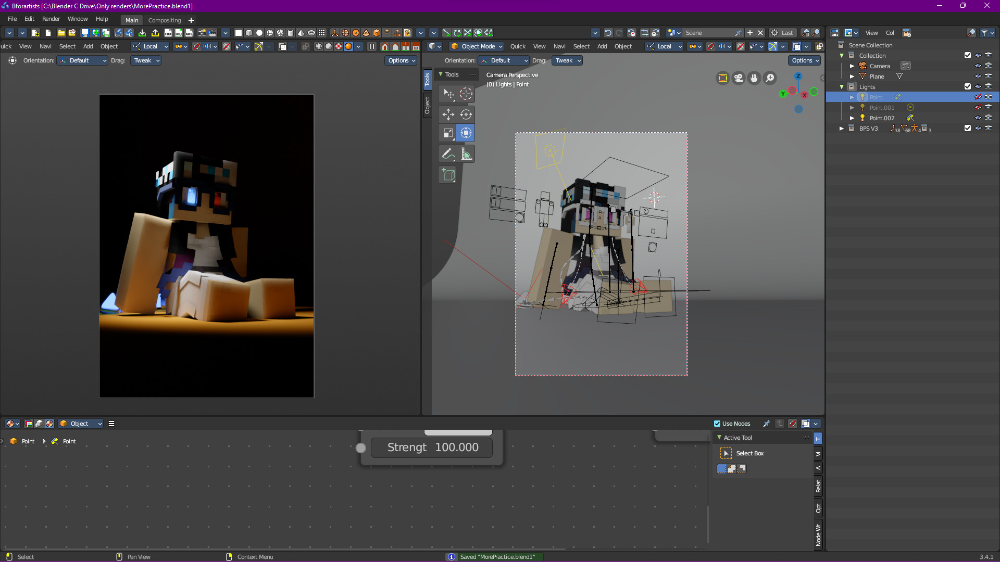

Now we're getting some of the details we were loosing, but we could do with a little more sculpting. That's where the kick light comes in:
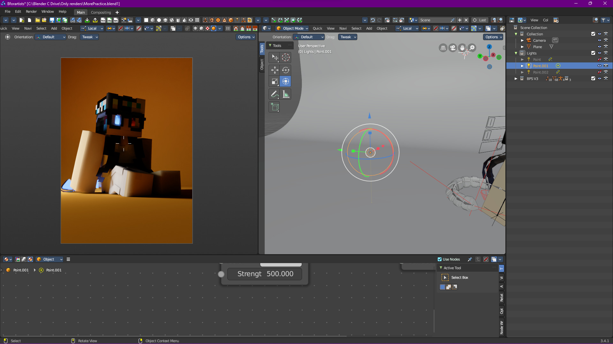

I should highly emphasize how this time, the kick light is not an area light. For the purposes of this render, a point light makes the perfect kick light.

If we combine it back with the rim light, we get some nice results:
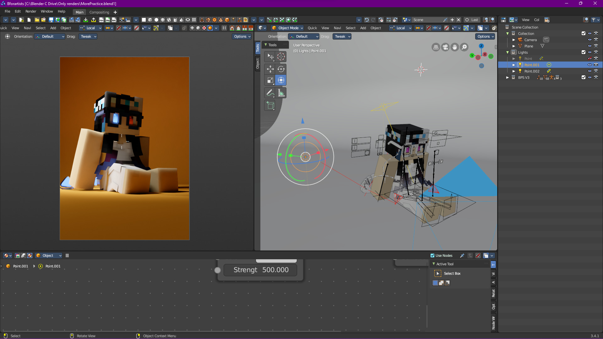

## An Aside: Bounce Lighting
This scene also makes for a good example of bounce lighting and how much of an impact it has on how a scene looks. Let's revisit how it currently looks:
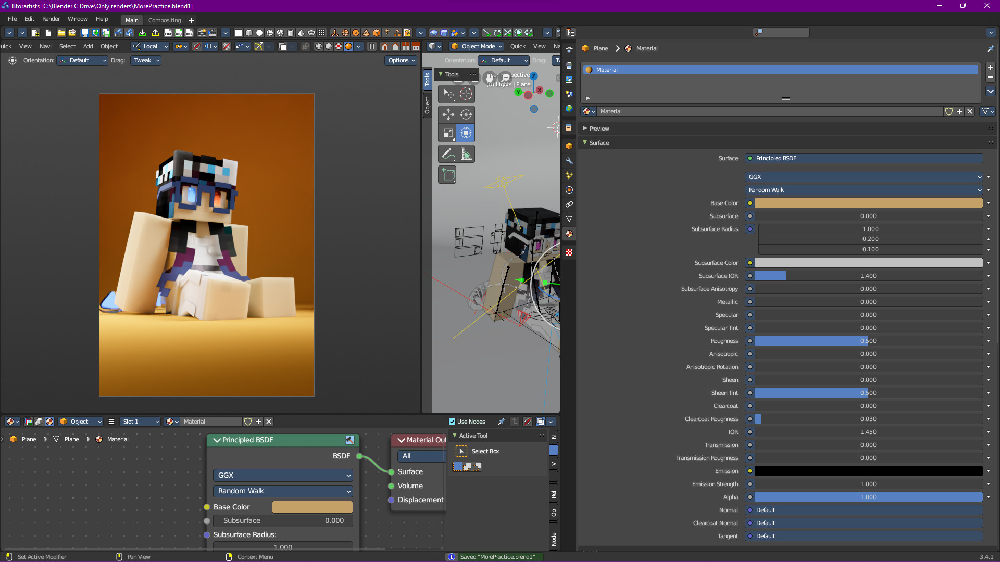

Now let's change the background to be green:
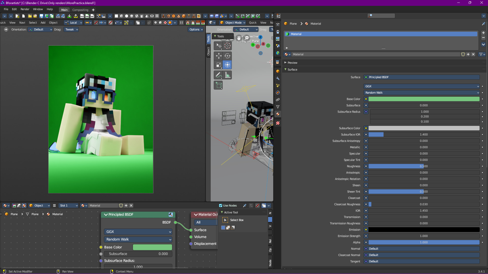

Yeah… that doesn't look right, and all we did was change the color. Meanwhile, if we change it to red:
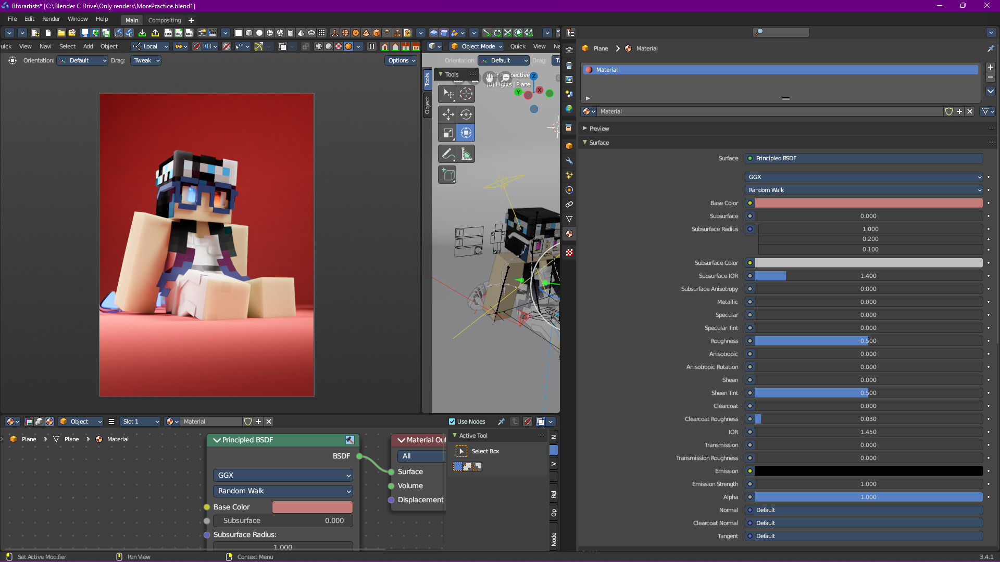

Doesn't look bad, but the overall vibe has changed in a way that I don't like (although I bet some people would actually prefer this over the original).

# A More Complex Example
I think it's now time to introduce something a bit more complex, so here we go.

We're going to start with the following:
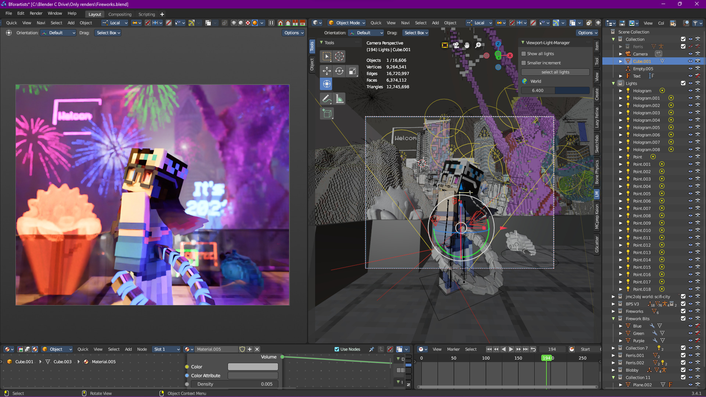


> This is a very simplified overview; the scene in question is extremely complex. 


First off, we got the light from the giant hologram statue (not Ferris the Rust mascot, the purple hologram on the right):
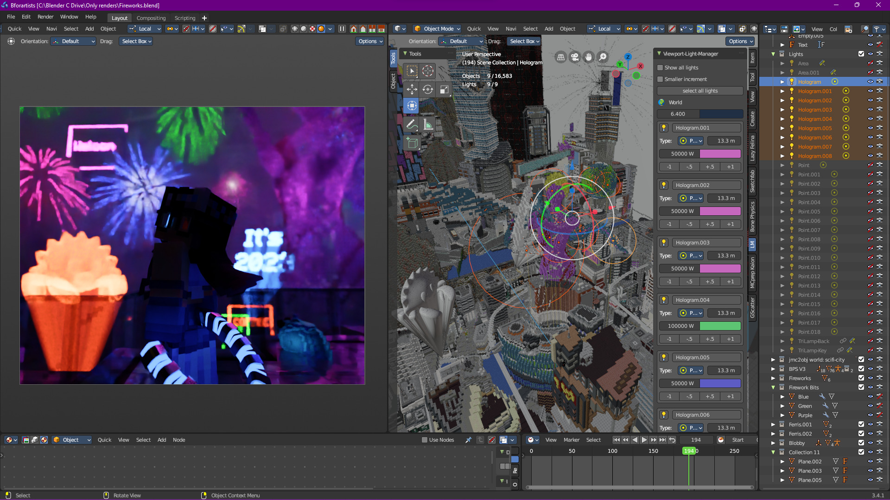

That's already a lot of light being provided, and this is on top of the environment lighting:
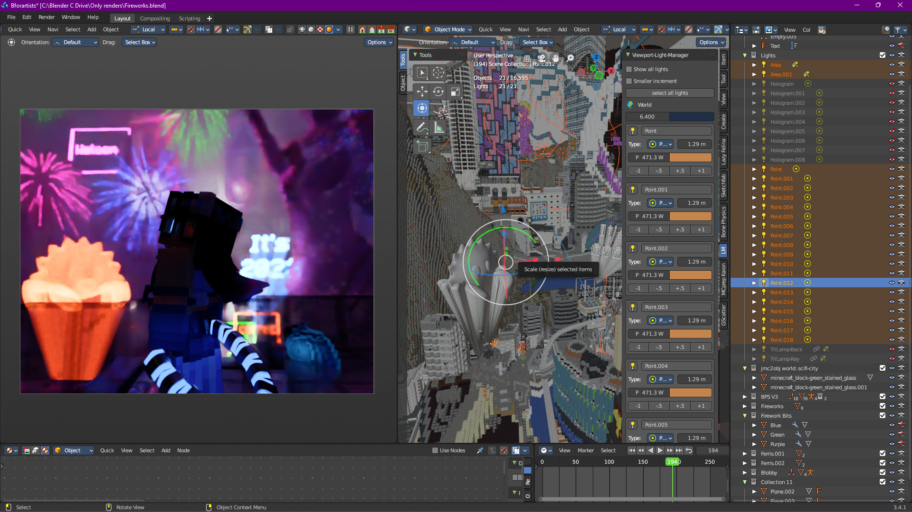

That's… bright. Most of it is to highlight the chaos of the city (hey, third year of the 2020s, it's been hectic), but now we can move on to the subject:
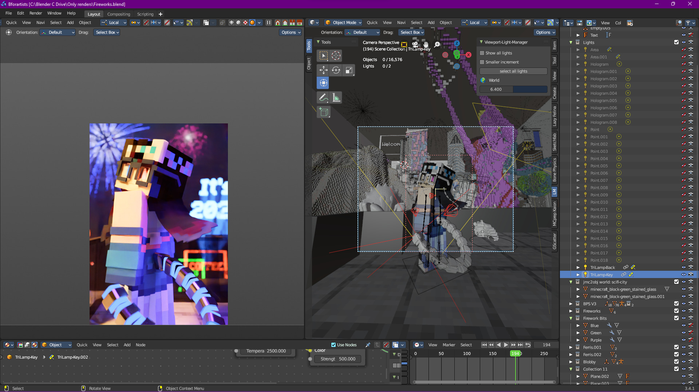

This is actually 2 lights, one simple area light with a blackbody node that serves as the main light:
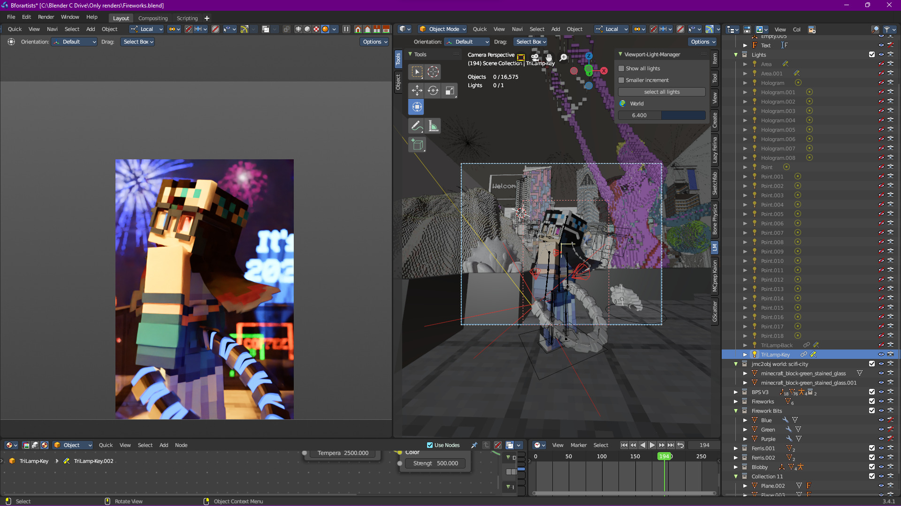

And one kick light to highlight some of the extra details that otherwise would be missing (like the hair and the sides of the glasses), as well as give more shape to the tail:

The kick light is also a different color, to make things a little more interesting. 

Was that extremely simplified? Yes, but this simplified approach helps when dealing tons of light sources, since they can generally be categorized in a couple of groups.


> If you're able to, study how others set up their lighting setups. Granted, you may not have access to their files, but you could likely figure out how a certain effect was made. And if you can't, just ask! Most artists don't mind being asked, so take advantage.

