I think the best way to explain my point is to show a practical example, so I've set up a scene that we're going to build together. The goal is to end up with something like this:

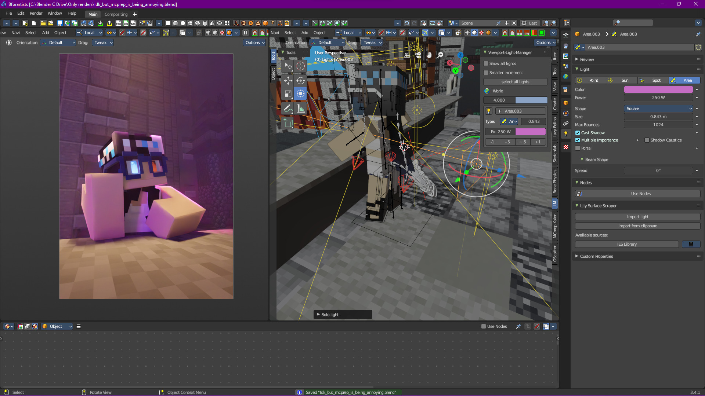

So let's get started. Here's what we currently have:

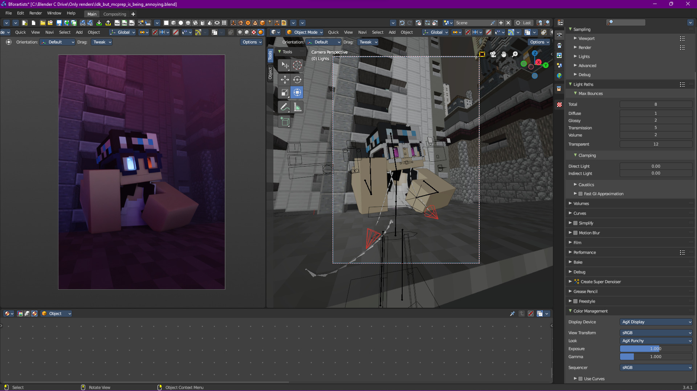

I've gone ahead and added some basic environment lighting. This can be done in many ways, from adding an HDRI to adding light sources based on an existing scene. While I won't go over what I did in detail, I will introduce a fundamental law in environment lighting (and lighting in general):

>  “If it's off camera, do whatever the f-ck you want"
> 	 - The Off Camera Law

We don't really have much lighting right now, just from the environment, so let's think about what type of story we want to tell. Clearly the character is thinking about something, maybe while out in the city on a sidewalk. 


> While writing this, I realized that I could have gone a completely different direction with the lighting. Looking over the screenshots again reminded me of the opening of the trailer for Westside Story (specifically the 2021 version), which would have been really interesting in terms of using shadow. 
>
> That's one of the things I like about lighting, there's many ways to go about lighting the same scene. As such, I've decided to add another (albiet shorter) section on the other way we could go about lighting this scene in [[#What about a Different Way?]] 


With that, let's add a streetlamp:

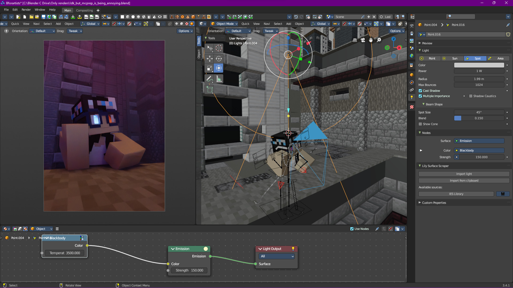

Looks decent, and we could leave it like that, but I want to make the light a bit more… streetlamp-ish, so let's use an IES texture.

IES textures are textures that represent light falloff. They're an amazing tool, and honestly I think they make a good replacement for spot lamps, but that's just me.

Once we add an IES texture and change the brightness, we get something like this:


> You can find IES textures anywhere, just search on Google. I find [IES Library](https://ieslibrary.com/en/home) to be a good source.


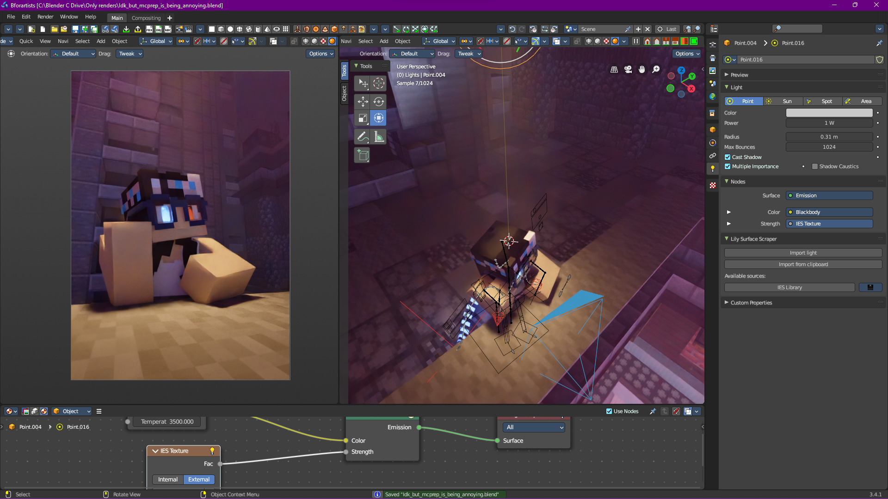

Good start, let's move on.

# Sculpting With Light
Now we could leave it like this, but it's not that interesting. One particular skill in lighting is “sculpting” the outline of your subject with light.


> I call it sculpting because it's the process of making the subject stand out from the background, but you can call it whatever! Just make sure that it helps you remember the goal of what we do in this section.


For this example, we're going to completely separate the character from the background, but you could also partially leave a subject in darkness. Again, it all goes back to storytelling, and the type of story you want to tell!

Let's first add an area light to highlight one of the edges of the head:

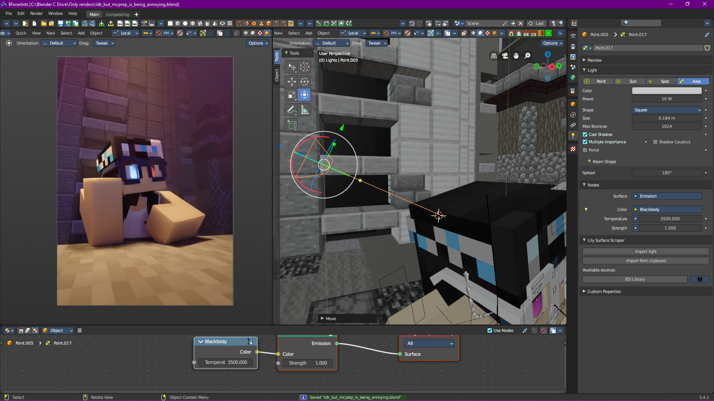

Well, that didn't make that much of a difference, and that's because of a feature area lights have called “Beam Spread”

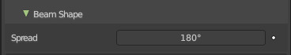

By default, it's set to 180, which is extremely diffuse. Let's reduce that:
![[Sculpting With Light/Reduced Spread.jpg]]


> “What's the point of beam spread?"
>
> Beam spread can be useful when you want to control how soft or hard your shadows are without adjusting the size of the actual light itself. It allows an area light to act like a soft box basically.


Now let's add some extra lights to highlight the left arm/shoulder:
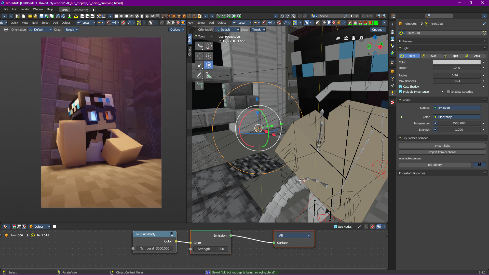

Now this is getting boring, it's all one color. This is supposed to be a city with a lot of neon lights, so let's add another one (remember The Off Camera Law?):

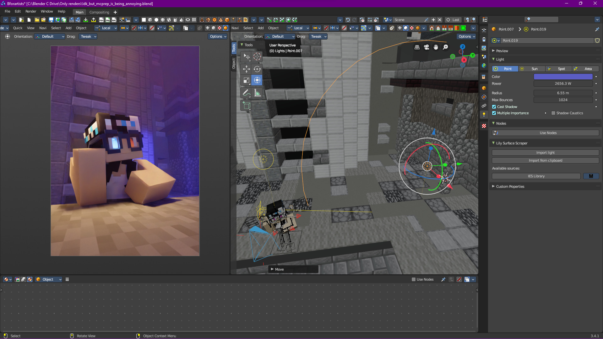

Yeah, that doesn't look good, it just looks like something from the background. What if we turn it into an area light?

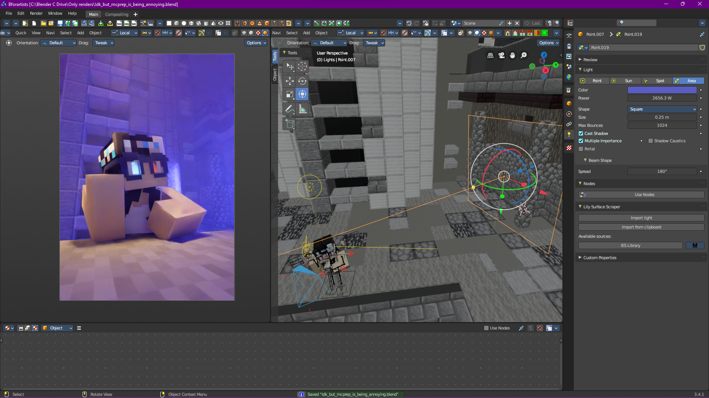

A bit too powerful, and reducing the strength doesn't seem to help. What if we make it a small point light and use it to sculpt out another part of the head?

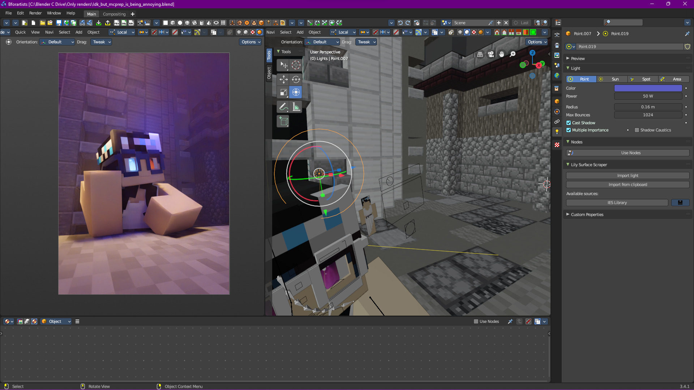

Still no, is there any other way to add a second col- OH, kick light:

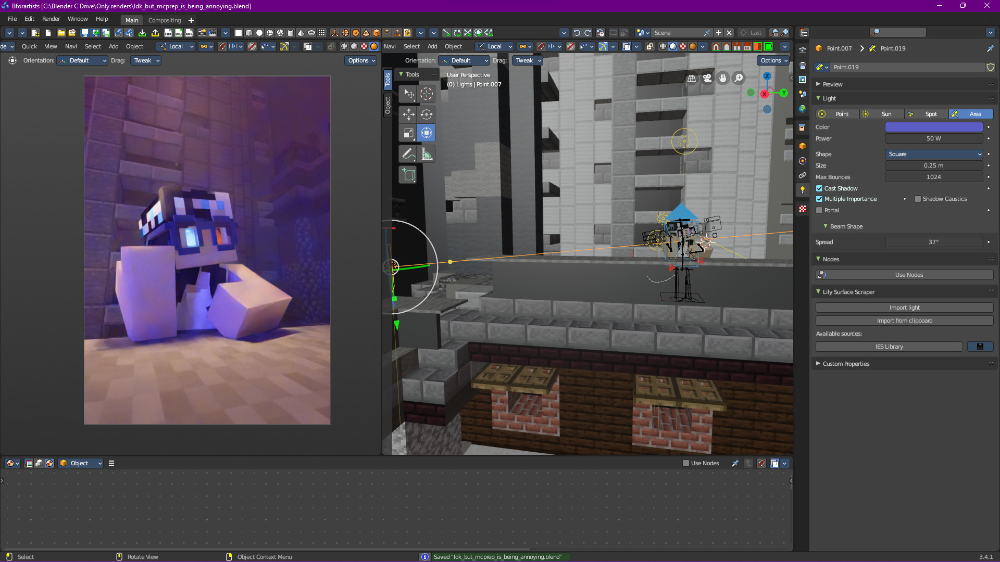


> “What is kick light?"
>
> Kick light is a bit hard to define, but basically helps to add some “shaping” to the subject. One could argue that technically the light in this scene isn't a kick light, but I digress.


Let's reduce the strength and add a pink one for some extra variation:

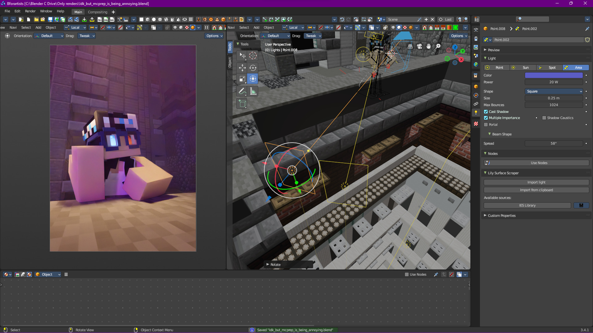

Alright, we're getting somewhere!

# We Need More ***STYLE***
Obviously since this is 3D, we can do whatever we want. In fact, alongside the Off Camera Law, there's another law in 3D:

> “3D has no limits, except for your software's limits, so do whatever makes your scene look good”
> 	- The No Limits Theorem

So let's add a rim light:

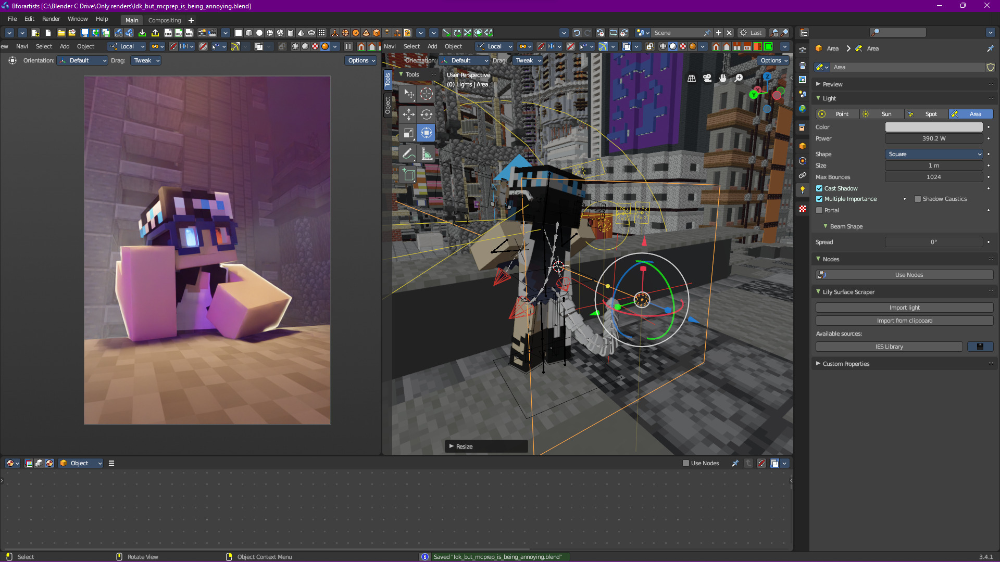

Of course, we have some volumetrics in the scene (maybe you noticed earlier) so we need to disable volumetrics for this light:
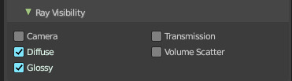

Now I want to tweak this further, but I want this light to only affect the subject. Sadly, Blender doesn't have light linking (seriously, why?), so we're going to need to isolate this light on its own. Luckily, I have a light manager add-on (you can find them easily), so I can just do that with a single click:

Looks mostly ok, we just need some rim lighting for the head:
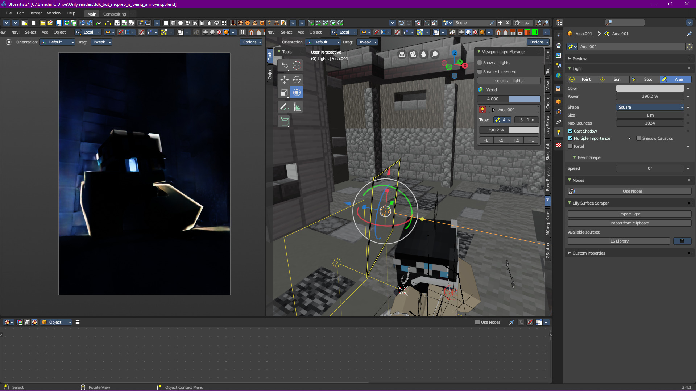

Let's change the color too, maybe blue?
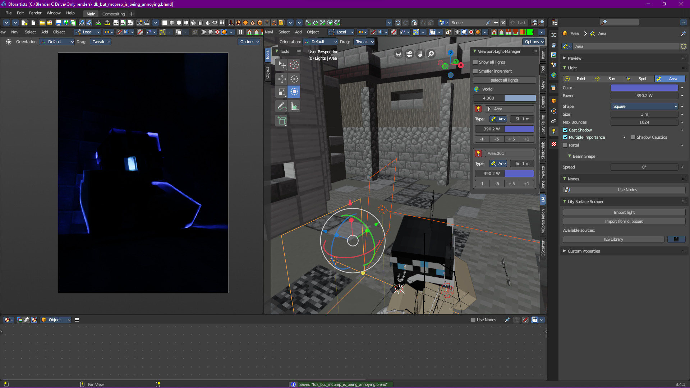

Nah, red?
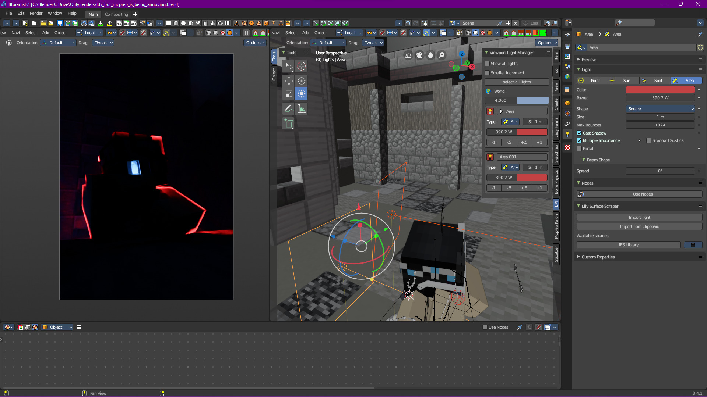

Not feeling it, pink?
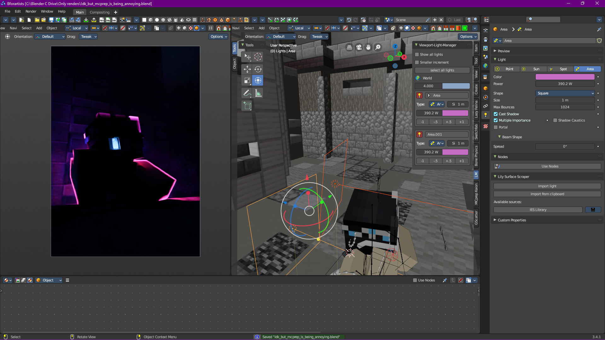

Looks fine, let's introduce everything else:
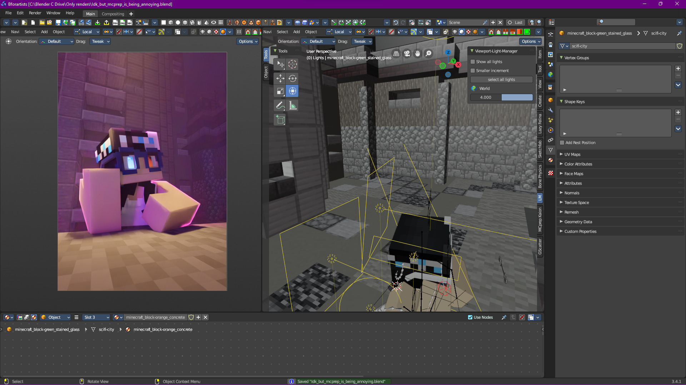

Perfect, just need to adjust some of the rim lighting because that right arm is looking weird:

I think we're done!


> Don't be scared to bend physics with light nodes for a stylized effect. Remember the No Limits Theorem, if it makes the scene look good, then it's perfectly fine to bend physics the way you want


